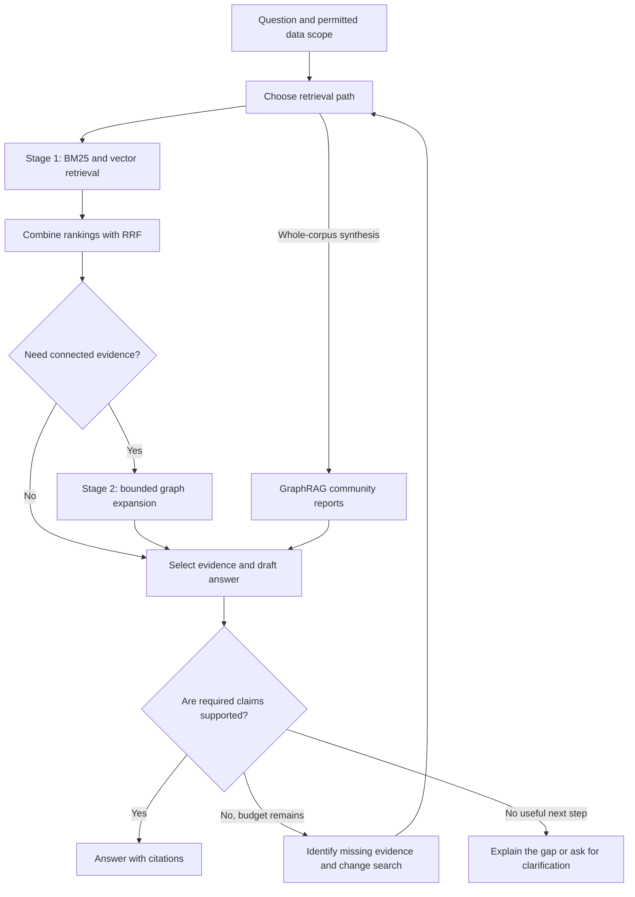

# Building RAG Systems: Retrieval, Graphs, and Knowing When to Search Again

A six-week, self-paced course built around your reading list.

**Pace:** two lessons per week, about 3–4 hours per week. Budget 18–24 hours for the readings, written exercises, and architecture capstone; a working software implementation is an optional extension.

**Starting point:** you know broadly what an LLM does. No prior information-retrieval research is required. Basic Python helps with the optional coding exercises. Complete the exercises on paper if you prefer.

**Finish line:** explain, design, and evaluate a system that retrieves candidates with BM25 and vectors, combines rankings, uses Redis for search, expands evidence through relationships, and decides whether to retrieve again or stop.

This course follows your Stage 1 / Stage 2 architecture as a learning scaffold. It is a proposed system design, not an architecture prescribed jointly by the papers. The exercises, budgets, corpus, and decision rules below are original teaching examples. Documentation was checked on September 14, 2026. Command examples are instructional and were not run against a Redis server.

## Your learning path

| Week | Lessons | What you produce |
|---|---|---|
| 1 | 1. RAG foundations; 2. BM25 | An evidence map and a hand-calculated lexical score |
| 2 | 3. Vector retrieval; 4. Reciprocal Rank Fusion | A retrieval comparison and a fused ranking |
| 3 | 5. Redis hybrid search; 6. Routing | A search schema and a routing policy |
| 4 | 7. Graph expansion; 8. Microsoft GraphRAG | A small evidence graph and a local/global search comparison |
| 5 | 9. Self-RAG; 10. Adaptive-RAG | A claim audit and a strategy-selection experiment |
| 6 | 11. Recovery paths; 12. Evaluation and capstone | A complete architecture with a measurable stopping policy |

For each lesson: read the explanation, attempt the exercise, consult the assigned source, then answer the checkpoint without looking back. Answers are at the end. Read research papers in three passes: abstract and figures; method and worked examples; evaluation and limitations. Full derivations and appendices are optional on the first pass.

## The system you are learning to build

There are two timelines. **Before a question arrives**, ingest documents, preserve source metadata, divide text into retrievable units, build search indexes, and optionally construct a graph and community reports. **At question time**, choose a path, gather evidence, and produce a supported answer.



Here, a **candidate** is a source chunk. An **index** is the structure used to find candidates. If your system first chooses among whole collections or indexes, treat that as a separate routing decision; collection IDs and chunk IDs are different ranking units.

## The running example: the Harbor case file

All names and facts in this miniature corpus are fictional. Treat each row as one source chunk. Every chunk belongs to case `harbor`; C8 is restricted. The default learner can access C1–C7 only.

| ID | Source | Text |
|---|---|---|
| C1 | Incident report | On May 12, Harbor's delivery was delayed because Dock 4 was unavailable. The report does not identify why the dock was unavailable. |
| C2 | Maintenance log | Dock 4 was unavailable on May 12 because Crane 7 failed inspection. |
| C3 | Inspection record | Crane 7 failed its May 12 inspection because of a hydraulic leak. |
| C4 | Supplier record | Northstar Services supplied the replacement seal for Crane 7 on May 13. |
| C5 | Incident report | On May 20, Harbor experienced another delivery delay because a truck arrived late. |
| C6 | Billing policy | An invoice dispute is a billing disagreement. Customers must report it within 30 days. |
| C7 | Status note | Dock 4 reopened on May 14 after repairs were completed. |
| C8 | Restricted review | A private review estimates the cost of the May 12 disruption. Its amount is not available to ordinary case readers. |

Use these questions throughout:

| Question | What a successful answer needs |
|---|---|
| Q1. When did Dock 4 reopen? | C7 |
| Q2. How long do customers have to challenge a bill? | C6, despite different wording |
| Q3. What equipment problem led to the May 12 delay? | The chain C1 → C2 → C3 |
| Q4. What caused Harbor's delays across the reports? | Both C1 and C5; additional detail from C2–C3 if requested |
| Q5. Did Northstar cause the crane failure? | Distinguish C4's later supply event from evidence of causation; the cause attribution is unsupported |
| Q6. What was the financial loss on May 12? | Explain that the accessible evidence does not provide an amount |

## Lesson 1 — What RAG adds, and where it can fail

**Goal:** distinguish finding evidence from writing an answer.

Retrieval-augmented generation supplies external material to a model while it answers. A useful first implementation is: retrieve chunks, place them alongside the question, and ask for a source-supported response. The research methods later in this course change how much retrieval happens and how evidence is selected. [Adaptive-RAG, background and method](https://arxiv.org/html/2403.14403v2).

For Harbor, imagine the system answers Q3 using only C1. It can correctly say the dock was unavailable, but cannot establish the equipment problem. If it invents a hydraulic leak without seeing C3, a fact that happens to be correct still lacks a retrieved basis. If it sees C1–C3 but says the truck was late, retrieval succeeded and answer generation failed.

Separate four questions when debugging:

1. Is the needed information in the accessible corpus?
2. Did retrieval find it?
3. Did context selection retain it?
4. Did the answer represent it accurately?

**Exercise:** write a one-sentence answer to Q3 with only C1, then with C1–C3. Underline each claim and assign a supporting chunk. Do the same for Q5. Save this as your first evidence map.

**Checkpoint 1:** can a plausible, factually correct answer still fail an evidence-grounding requirement?

**Optional build:** represent each chunk as a record with `chunk_id`, `document_id`, `text`, `case_id`, `source_date`, and `access_group`. Keep these fields through every retrieval step.

## Lesson 2 — BM25: why matching words still matters

**Goal:** explain rarity, frequency saturation, and length normalization.

BM25 scores lexical matches. A term contributes according to how informative it is across the collection, how often it occurs in a document, and document length. Repetition has diminishing returns; long documents do not automatically win by containing more words. The parameter `k1` controls frequency saturation, and `b` controls length normalization. BM25 produces a ranking score, not a calibrated probability that an answer is true. [Robertson & Zaragoza, author-hosted paper](https://www.staff.city.ac.uk/~sbrp622/papers/foundations_bm25_review.pdf).

A common teaching form, summing over distinct query terms, is:

```text
score(q,d) = Σ IDF(t) × f(t,d)(k1 + 1)
                        ─────────────────────────────
                        f(t,d) + k1(1 − b + b|d|/avgdl)
```

Here, `f` is term frequency, `|d|` is document length, and `avgdl` is the collection's average document length. Implementations vary in IDF and other details.

**Read:** the introduction, §2.3, and §§3.4–3.5. Return to BM25F in §3.6 later if you need separate title/body weighting.

**Worked exercise:** isolate one term and set its IDF to 2, `k1=1.2`, and `b=0.75`. Document A has length equal to the average and term frequency 1. Document B has the same length and frequency 4. Their contributions are 2.000 and approximately 3.385. Four occurrences do not earn four times the score.

Now calculate document C: frequency 1, length twice the average. What changes when `b=0`? These numbers are a mathematical illustration, not scores measured from the Harbor corpus.

**Harbor application:** list three literal strings that could be useful search anchors: a dock identifier, an equipment identifier, and a date. Compare them with Q2's paraphrase.

**Checkpoint 2:** what is C's score, and what happens to its length penalty when `b=0`?

## Lesson 3 — Vector retrieval: finding similar meaning

**Goal:** separate the embedding model from the algorithm that searches its vectors.

An embedding represents text as numbers. A query is embedded in a compatible space, and search finds nearby stored vectors. Redis supports distance measures including cosine, L2, and inner product. FLAT performs exhaustive vector comparison; HNSW uses an approximate graph-based search with tunable accuracy, speed, and memory tradeoffs. Increasing HNSW search effort can improve neighbor recall at additional query cost. Matching vector dimensions alone does not establish embedding compatibility. [Redis vector concepts](https://redis.io/docs/latest/develop/ai/search-and-query/vectors/).

For this course, begin with FLAT as a reference. Try HNSW after you can measure the difference. A larger index is a reason to benchmark alternatives; it is not a universal threshold that dictates the right algorithm.

**Exercise:** predict whether lexical or vector retrieval will better handle Q1 and Q2. Record this as a hypothesis, not a result. A model might connect “challenge a bill” with “invoice dispute,” but it might also retrieve a topically similar policy that lacks the deadline.

Suppose a FLAT search returns IDs `{A,B,C,D,E}` and HNSW returns `{A,B,D,F,G}` for the same top-five query. Neighbor recall is `3/5 = 60%`. This measures agreement with exact vector neighbors. It does not tell you whether any of those neighbors answer the question.

**Checkpoint 3:** could perfect nearest-neighbor retrieval still deliver irrelevant evidence?

**Optional build:** embed C1–C7 using one model and its documented query/document settings. Compare top-five FLAT results with HNSW. Log the embedding model, dimensions, distance metric, and HNSW settings. Do not treat hand-invented numeric vectors as semantic embeddings.

## Lesson 4 — RRF: combining rankings

**Goal:** combine lexical and semantic retrieval without adding incompatible raw scores.

Reciprocal Rank Fusion adds contributions based on each candidate's position in each list:

```text
RRF(d) = Σ 1 / (c + rank_i(d))
```

Use one-based ranks. In a truncated-list implementation, a missing candidate contributes zero for that list. The paper uses `c=60`; this constant is different from the number of results you retrieve. RRF rewards strong placement across lists, while discarding raw score magnitudes. The paper's positive experimental results are not a guarantee for a new corpus. [Cormack, Clarke & Büttcher, RRF paper](https://cormack.uwaterloo.ca/cormacksigir09-rrf.pdf).

**Worked exercise:** these rankings are invented for arithmetic practice, not measured Harbor results.

| Candidate | BM25 rank | Vector rank | RRF with c=60 |
|---|---:|---:|---:|
| A | 1 | 3 | 0.032266 |
| B | 2 | 1 | 0.032522 |
| C | 3 | absent | 0.015873 |
| D | absent | 2 | 0.016129 |

The combined order is **B, A, D, C**.

**Exercise:** recompute with `c=1`. Then remove A from the vector list and recompute with `c=60`. Explain what changed. Next, imagine both searches omit the only answer-bearing chunk: what can fusion recover?

**Optional build:** use this small implementation. Repeated IDs within one list count only once; exact fused ties break by ID for reproducibility.

```python
def rrf(rankings, constant=60):
    if constant < 0:
        raise ValueError("constant must be nonnegative")
    scores = {}
    for ranking in rankings:
        unique_ids = list(dict.fromkeys(ranking))
        for rank, chunk_id in enumerate(unique_ids, start=1):
            scores[chunk_id] = scores.get(chunk_id, 0.0) + 1 / (constant + rank)
    return sorted(scores.items(), key=lambda item: (-item[1], item[0]))

print(rrf([["A", "B", "C"], ["B", "D", "A"]]))
```

**Checkpoint 4:** why is an RRF score of 0.0325 not “3.25% confidence”?

## Lesson 5 — Redis: what “native hybrid search” means

**Goal:** map the retrieval design to Redis capabilities.

Redis Search indexes hash or JSON documents and supports full-text and vector search within the same search engine. [Redis Search overview](https://redis.io/docs/latest/develop/ai/search-and-query/).

For Harbor, use this conceptual schema:

| Field | Suggested type | Purpose |
|---|---|---|
| `case_id` | TAG | Select Harbor's records |
| `access_group` | TAG | Apply an application-enforced access scope |
| `text` | TEXT | Search words in the chunk |
| `embedding` | VECTOR | Search embedded meaning |
| `source_time` | NUMERIC | Restrict by an encoded timestamp when needed |
| `chunk_id`, source reference | Stored metadata | Recover and cite the original passage |

TAG fields match categorical values rather than applying normal full-text token analysis. A TAG field provides filtering machinery; your application must supply the correct permitted scope. [Redis TAG documentation](https://redis.io/docs/latest/develop/ai/search-and-query/advanced-concepts/tags/).

Distinguish three operations:

| Operation | What happens |
|---|---|
| Filtered vector search | Find nearest vectors within an eligible subset |
| Application-side fusion | Run lexical and vector searches, then merge their rankings in your code |
| Server-side fusion | Ask Redis to run and combine both branches |

A keyword condition inside a filtered KNN query constrains eligibility; it does not automatically create two rankings and fuse them. [Redis vector queries](https://redis.io/docs/latest/develop/ai/search-and-query/query/vector-search/).

Current Redis documentation lists `FT.HYBRID` from Redis Open Source 8.4.0, with RRF and linear combination options. RRF is the documented default. Server and client compatibility still matter. For an older deployment without this command, separate supported queries plus application-side RRF provide a straightforward teaching path. [FT.HYBRID reference](https://redis.io/docs/latest/commands/ft.hybrid/).

Current scoring documentation names `BM25STD` and notes the older `BM25` name's deprecation. Record the actual scorer and server version when comparing experiments. [Redis scoring](https://redis.io/docs/latest/develop/ai/search-and-query/advanced-concepts/scoring/).

**Exercise:** draw the two retrieval branches for Q3. Apply case and access restrictions to both. Retrieve up to 20 candidates per branch, fuse, and select up to five chunks. These are starting exercise settings; the tiny corpus will return fewer than 20. State where embeddings are generated and where the final answer is written.

**Optional command study:** after creating an appropriate index and loading real embeddings, this illustrates the shape of an unrestricted hybrid query over a permitted-only index. `<binary-vector>` is a placeholder for a client's binary parameter, not a literal vector string.

```text
FT.HYBRID harbor_public_idx
  SEARCH "@text:(dock | crane)"
  VSIM @embedding $q
  KNN 2 K 20
  COMBINE RRF 4 WINDOW 20 CONSTANT 60
  LIMIT 0 5
  PARAMS 2 q <binary-vector>
```

Use the command reference for your installed version before running it. For a shared index, enforce scope in each branch; filtering only one branch can admit out-of-scope candidates through the other.

**Repository exercise:** open [RediSearch on GitHub](https://github.com/RediSearch/RediSearch), locate release notes for your chosen version, and record one relevant search feature. Treat repository `master` and an installed release as potentially different code.

**Checkpoint 5:** does Redis providing text search and vector KNN mean it also decides when the evidence is sufficient?

## Lesson 6 — Routing: use the LLM for an unresolved choice

**Goal:** distinguish route selection, fusion, and reranking.

LlamaIndex's `RouterQueryEngine` selects among query engines, using descriptions and a selector; it supports selecting one or multiple destinations. LangChain's current routing examples likewise classify input and direct execution. These are mechanisms for choosing a path. [LlamaIndex routers](https://developers.llamaindex.ai/python/framework/module_guides/querying/router/), [LangGraph routing](https://docs.langchain.com/oss/python/langgraph/workflows-agents).

Your proposed “LLM as tie-breaker” is a design choice we will test: apply clear rules first, and ask the LLM only when the remaining route is ambiguous. If it instead compares retrieved passages to decide their order, that is reranking. A tiny gap between RRF scores is not itself evidence that route selection is ambiguous.

**Exercise:** design a router with three destinations: `hybrid`, `graph_local`, and `global_summary`. Write one description and two example questions per destination. Add a `clarify` outcome for requests such as “What happened there?” with no usable context.

For an ambiguous query, have the router return a destination and a short, checkable justification tied to the question. Do not use a self-reported confidence percentage as your only acceptance rule.

Try ten paraphrases of Q3 and Q4. Record whether the chosen route changes and whether it still answers correctly. Compare against always using hybrid retrieval. If routing costs more and improves nothing in this exercise, keep the simpler policy.

**Read:** the LlamaIndex usage pattern and selector descriptions, then the routing section of the linked LangGraph guide. Your original [LangChain v0.2 routing link](https://python.langchain.com/v0.2/docs/how_to/routing/) is a versioned historical reference; use current documentation for new code.

**Checkpoint 6:** an LLM chooses passage B over passage A after reading both. Is that routing or reranking?

## Lesson 7 — Graph expansion: follow evidence-bearing relationships

**Goal:** recover connected facts that the original query may not name.

In our proposed Stage 2, the first retrieval supplies starting chunks or entities. A graph then reveals nearby relationships, and each useful relationship leads back to source text. This is an application design exercise. Microsoft GraphRAG's local search similarly combines graph information with source text, but its actual context construction is more elaborate than this small example. [GraphRAG local search](https://microsoft.github.io/graphrag/query/local_search/).

Build the following source-backed chain:

```text
Harbor delay on May 12
  -- occurred because --> Dock 4 unavailable [C1]
  -- unavailable because --> Crane 7 failed inspection [C2]
  -- inspection failed because --> hydraulic leak [C3]
```

Store an edge's direction, relation type, date or event scope, and source chunk. “Northstar supplied a seal” must not become “Northstar caused the failure.” Shared names alone do not establish the intended entity or event.

**Exercise:** add C4 and C7 to your graph. Start with C1 and follow at most two edges to answer Q3. For this exercise, the starting event is hop zero. Mark the edge that supplies each new fact. Then add 20 irrelevant documents mentioning Harbor and consider why unrestricted expansion would overwhelm your context.

Choose a two-hop limit, at most six added chunks, and relations relevant to the question. These are trial budgets. Keep a visited set to avoid cycles and recheck access before including any source. Record why each added chunk matters.

**Checkpoint 7:** why can a graph path linking a supplier to a broken machine fail to prove responsibility?

**Optional build:** represent edges as a list of records and use a simple bounded traversal. You do not need a separate graph database for eight source chunks. Do not confuse HNSW's vector-neighbor graph with this graph of named entities and relationships.

## Lesson 8 — Microsoft GraphRAG: local facts and global themes

**Goal:** explain what the paper adds beyond neighboring-entity expansion.

The GraphRAG paper builds an entity graph from source documents, organizes it into communities, and produces community summaries. It uses these summaries to support questions about patterns across a corpus. Its central research focus is query-focused summarization at a broader scope than retrieving a few similar passages. [Edge et al., GraphRAG paper](https://arxiv.org/html/2404.16130v2).

The implementation distinguishes local, entity-centered context gathering from global search over community reports. Global search creates intermediate responses from report batches and combines selected material into a final response. It can enter through community reports without first following our BM25 → RRF → graph expansion sequence. [Local search](https://microsoft.github.io/graphrag/query/local_search/), [global search](https://microsoft.github.io/graphrag/query/global_search/).

**Exercise:** make two hand-written reports: “equipment and dock disruption” from C1–C3 and C7, and “transport delay” from C5. Cite the underlying chunks. Use both reports to answer Q4 in 80 words. Then answer Q1 directly from C7. Compare the amount of preparation and context required.

Deliberately remove the transport report and answer Q4 again. Identify the missing theme. This demonstrates a possible coverage failure; the tiny corpus cannot establish a general performance advantage for GraphRAG.

**Read:** the paper's pipeline and global-answer method, then its evaluation question and limitations. Ask what was measured and whether your question types resemble the study's. Explore the [reference implementation](https://github.com/microsoft/graphrag) and [documentation](https://microsoft.github.io/graphrag/). Your supplied [aka.ms link](https://aka.ms/graphrag) is also retained here for reference.

**Checkpoint 8:** which is the better initial fit: local evidence for Q1 or a global community-summary answer? Why?

## Lesson 9 — Self-RAG: retrieve, generate, and critique

**Goal:** separate the research method from a simple prompted review loop.

Self-RAG trains a model to emit reflection tokens alongside generated text. These signals concern whether retrieval is useful, whether a passage is relevant, whether a generated segment is supported, and how useful the response is. Training and inference both contribute to the method. Asking an ordinary LLM to “check your answer” does not reproduce the trained Self-RAG system. [Asai et al., Self-RAG](https://arxiv.org/html/2310.11511v1).

**Read:** Figure 1, the reflection-token table, and §3's training/inference overview. You should be able to identify which behavior was learned and which behavior is imposed by decoding or application logic.

**Exercise:** audit this deliberately faulty answer to Q5:

> Northstar caused the May 12 delay by supplying a defective seal. Dock 4 reopened on May 14.

For each claim, assign one of `supported`, `contradicted`, or `not established`, and give the evidence. The supplier record documents a replacement delivered on May 13. It does not establish who caused the earlier failure. The reopening date has direct support in C7.

Now write a bounded review instruction: extract claims, associate each with a passage, flag missing support, and identify one concrete evidence gap. Call this a **Self-RAG-inspired exercise**, since it does not train reflection tokens.

**Checkpoint 9:** does “I am confident” from the answering model demonstrate that its claims are supported?

## Lesson 10 — Adaptive-RAG: choose how much retrieval to do

**Goal:** choose an initial strategy according to the question's needs.

Adaptive-RAG trains a smaller classifier to choose among no retrieval, single-step retrieval, and multi-step retrieval. Its training labels use signals from strategy outcomes and dataset characteristics. This is chiefly an initial strategy decision, rather than a loop that starts only after a bad answer. [Jeong et al., Adaptive-RAG](https://arxiv.org/html/2403.14403v2).

For our course application, additionally require source lookup for case-specific facts even when the question is short. “When did Dock 4 reopen?” is simple in form, but its answer depends on this case file. A no-retrieval path is more suitable here for rewriting text already supplied in the question.

**Exercise:** assign a starting strategy to: rewrite a provided sentence; Q1; Q3; Q4; and Q6. Explain what evidence is needed. Do not label every long question “complex” or every short question “easy.”

Create a small comparison with three fixed strategies and your selected strategy. Log correctness, number of retrieval calls, and elapsed time. A useful classifier must save work or improve answers relative to a fixed baseline; route-label accuracy alone does not establish that.

**Checkpoint 10:** how does initial strategy selection differ from checking whether a draft answer has enough support?

## Lesson 11 — The “sad path”: identify the gap, then act

**Goal:** design useful recovery and explicit stopping conditions.

This lesson combines ideas from the preceding papers into an original application policy. It is not an implementation claimed by either paper. “Need more” should identify missing evidence or failed execution, not just repeat the same search.

| Observed problem | Proposed next action | Stop condition |
|---|---|---|
| Nothing relevant retrieved | Inspect filters and try an alias or paraphrase | One alternative adds no useful evidence |
| Missing link in an event chain | Retrieve the named intermediate entity/event | Required link found or graph budget reached |
| Question has several subparts | Search specifically for the unanswered part | All parts supported or remaining part unavailable |
| Sources disagree | Check dates, event scope, and original passages | Explain unresolved disagreement if it remains |
| Source is unavailable to this reader | State the accessible evidence gap | Do not widen access as a search retry |
| Search service errors | Use one bounded retry or a configured fallback | Report the failure if neither works |
| Request is ambiguous | Ask a focused clarifying question | Wait for the missing scope |

For the Harbor exercise, allow the initial retrieval cycle plus **at most two additional retrieval cycles**. Count a cycle as one policy-selected evidence-gathering round, and separately log the number of actual engine calls. Set a maximum of ten retained chunks, and stop early if a retry adds no new relevant evidence. These are teaching settings to test, not production defaults.

**Exercise:** simulate Q3 with an initial result containing only C1. Record the next query, newly found evidence, and stop reason. Repeat with Q6 and explain why more fluent drafting cannot supply the missing amount.

For Q5, a valid result is: “The available records show that Northstar supplied a replacement seal after the inspection failure. They do not establish that Northstar caused it.” Preserve that distinction even if many retrieved passages mention the supplier.

**Checkpoint 11:** after a retry returns the same insufficient evidence, what should the system do next?

## Lesson 12 — Evaluation and capstone

**Goal:** demonstrate which components improve the system and what they cost.

Your capstone is a design for a Harbor research assistant. The minimum submission is an architecture and evaluation workbook written in any format you prefer. Building the running application is optional additional work.

**Submit these six items:**

1. An ingestion plan: chunk IDs, source links, text and vector fields, embedding configuration, and update handling.
2. A Stage 1 plan: BM25, vector retrieval, shared scope filters, RRF, and separate candidate/context limits.
3. A routing policy: clear rules, the ambiguous cases sent to an LLM, and a clarification outcome.
4. A Stage 2 plan: graph relations, provenance, expansion limits, and when global community reports help.
5. A recovery policy: evidence checks, possible next actions, resource limits, and stop behavior.
6. An evaluation report: results by question type, at least three failures, and a justified recommendation.

### Build a small evaluation set

Start with 30 questions: five each for exact facts, paraphrases, multi-hop chains, global summaries, unsupported premises, and missing evidence. Mark expected answers and required source IDs before running your system. Use 15 for development and keep 15 unseen for a final comparison, splitting near-duplicate question families together to reduce leakage. This is a learning experiment; 15 held-out questions are too few for strong general claims.

The eight-chunk corpus is enough for a paper exercise. For a software capstone, expand it with clearly labeled fictional distractors, aliases, and dated events. Keep the same corpus and embedding model across comparisons unless that is the variable you are testing.

### Measure different stages separately

| Measure | Definition for this course | What it diagnoses |
|---|---|---|
| Evidence Recall@k | Required chunks retrieved / all required chunks | Whether retrieval found the necessary evidence |
| Complete evidence rate | Questions where every required chunk was found / answerable questions | Missing links in multi-hop questions |
| Reciprocal rank | 1 / position of first relevant chunk; 0 if absent | How early useful evidence appears |
| Claim support rate | Supported factual claims / factual claims made | Whether the answer stays within evidence |
| Answer completeness | Required answer elements supplied / required elements | Whether the answer covers the question |
| Correct abstention rate | Correctly declined unanswerable questions / unanswerable questions | Behavior when evidence is missing |
| False abstention rate | Declined answerable questions / answerable questions | Whether the system gives up too readily |
| Cost and latency | Tokens, engine calls, median and p95 elapsed time | Operational tradeoffs |

These are explicit course definitions so your comparisons use the same denominators. Score global answers against expected themes as well as source support. For Q3, retrieving C1 and C2 gives evidence recall `2/3`, but does not complete the equipment-cause chain. A short abstention must not earn a perfect claim-support score simply because it makes no claims; mark that case separately.

### Compare components by removing or adding one

Run the same questions through BM25 only, vectors only, BM25 + vectors + RRF, hybrid + graph expansion, and the full routing/recovery design. Separately compare local retrieval and community-summary retrieval on global questions. An improvement may help one category and hurt another; show both.

For each configuration, preserve the prompt, model settings, source corpus, and context budget as far as the comparison permits. Inspect actual answers rather than relying entirely on a model judging its own output. With a small sample, show individual failures alongside averages.

**Capstone rubric:** retrieval design 25 points; evidence/provenance 25; routing and recovery 20; evaluation quality 20; clarity and reproducibility 10. Aim for 80/100 and correct the following regardless of score: out-of-scope evidence entering answers, invented causal claims, and a recovery loop without a bound.

**Checkpoint 12:** if adding graph expansion improves multi-hop answers but increases latency and harms exact lookups, what change should you test?

## Answer key

1. **Yes.** Correctness and retrieved support are separate properties. A lucky answer is not a reliable evidence chain.
2. **About 1.419.** The numerator is 4.4 and denominator 3.1. At `b=0`, the length adjustment disappears and the score becomes 2.000.
3. **Yes.** Exact nearest neighbors are exact with respect to a representation and distance function, not automatically the information need.
4. **RRF is a rank aggregation score.** Its magnitude depends on the constant and contributing lists, and it is not calibrated to answer correctness. With `c=1`, the exercise order remains B, A, D, C. Removing A from the vector list at `c=60` produces B, A, D, C again, but reduces A's score to about 0.016393. Fusion cannot introduce a chunk absent from every input list.
5. **No.** Search capabilities supply candidates. Your application still specifies embedding generation, route selection, evidence checks, and answer generation.
6. **Reranking.** Choosing a search engine or workflow would be routing.
7. **Relations have distinct meanings.** Supplying a replacement after a failure does not establish responsibility for the failure. Inspect dates, relation labels, and supporting text.
8. **Local/direct retrieval.** Q1 asks for one fact explicitly stated in C7; global synthesis adds preparation without an obvious need.
9. **No.** Verify individual claims against retrieved passages. For the audit, the supplier-causation and defective-seal claims are not established; the reopening date is supported.
10. **One chooses the starting amount of work; the other checks the evidence obtained.** You can combine them, but they are different decisions.
11. **Use a materially different, justified action only if the policy permits it; otherwise stop.** Explain the remaining evidence gap or ask for missing scope. Repeating an unchanged search is not progress.
12. **Route selectively.** Test expansion for questions needing connected facts, while keeping a cheaper path for exact lookups. Verify the tradeoff on the held-out questions.

## Reading shelf and source notes

The core sources appear next to the lessons that use them. For the BM25 paper, your supplied [Semantic Scholar record](https://www.semanticscholar.org/paper/The-Probabilistic-Relevance-Framework:-BM25-and-Robertson-Zaragoza/47ced790a563344efae66588b5fb7fe6cca29ed3) did not load during checking; the linked author-hosted PDF supplies the paper itself. The supplied LangChain v0.2 page and GraphRAG short link also did not load, so the course supplies current official documentation and the Microsoft repository.

Keep a one-page reading note for each paper: the problem, the proposed mechanism, what was trained or precomputed, what happens at question time, what the experiments establish, and one reason the result might not transfer to Harbor.

## Start here

Spend your first 30 minutes reading the Harbor corpus and completing Lesson 1's evidence map. Then explain, without notes, why Q1, Q3, and Q6 require different behavior. That gives you a concrete question to carry into every subsequent paper: **what additional evidence does this technique help me find, and how will I know it helped?**
